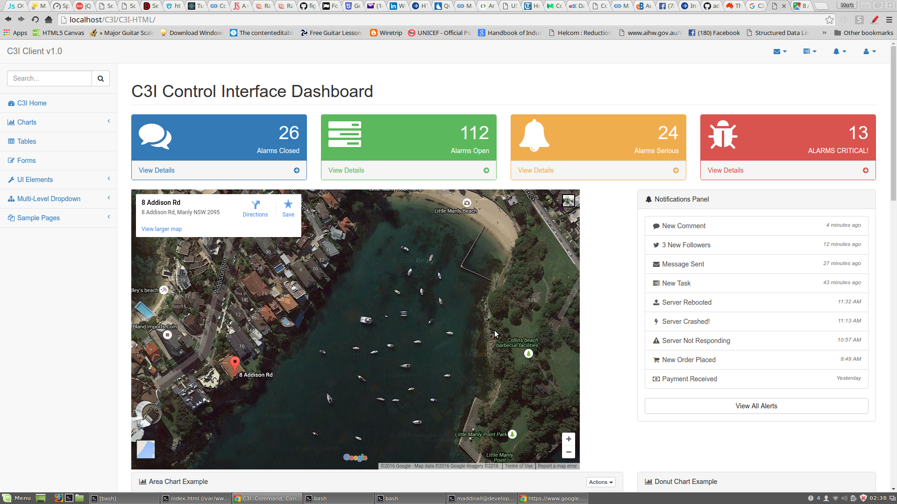

# REDUX/REACT/Node.js/Mongo
## rr-C3I
### Mark Addinall - Brisbane - July 2016

------
## Synopsis

This is the last of my experimentation with different Full stack technologies for 2016.
I have built

- Modern, but more traditional HTML5/CSS3/Bootstrap/jQuery front end with AJaJ RESTful API to a PHP data server
- Angular2/Bootstrap full stack through to MONGO data server
- METEOR - REACT full stack through to MONGO data server
- This REDUX - REACT full stack through to MONGO data server

Why all of this work?

The current state of the Frameworks is in flux (HA!) with Angular1 approaching end of
life whilst Angular2 is still very much BETA;  The current confusion as where METEOR is headed
and the current lack of a consistant development strucural story for that stack;  the fact that
getting the traditional PHP back end to work with modern frameworks is getting harder by the week
and the popularity (up coming) of REDUX led me to have a good look at these choices for my
future application builds.

I'll publish my results later this year.

